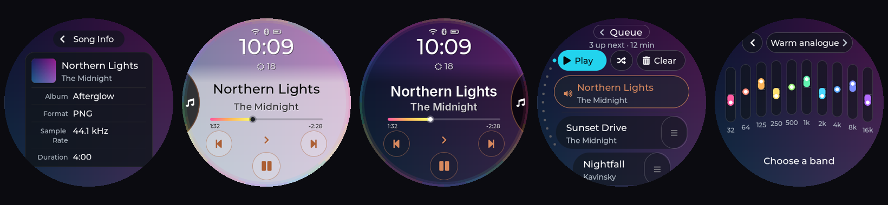
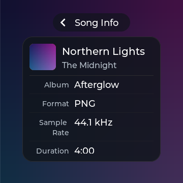
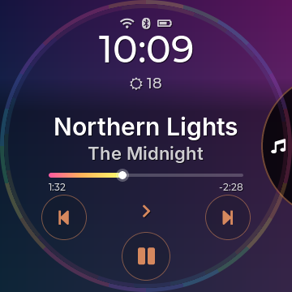
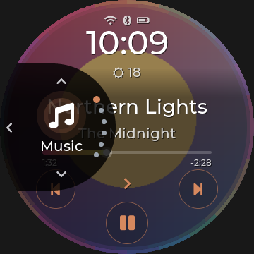
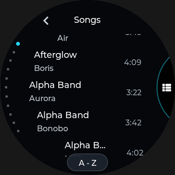
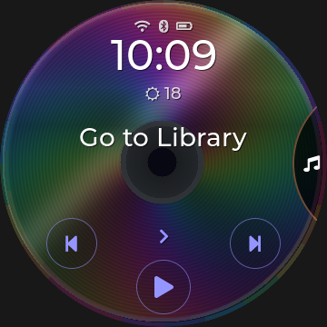
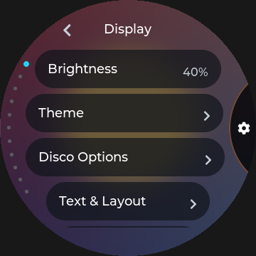

<h1 align="center">diskOS Disco!</h1>

<p align="center">
  <b>The album cover is the interface.</b><br>
  A touch UI for the round screen of the FiiO Snowsky Disc, built on
  <a href="https://github.com/b0hemia/diskos">b0hemia's diskOS</a>.
</p>

<p align="center">
  
</p>

<p align="center">
  <a href="https://github.com/zmd22/diskos-disco/releases/latest"></a>
  
  
  <a href="ui/COPYING"></a>
</p>

<p align="center">
  <a href="docs/DISCO_TOUR.md"><b>Tour</b></a> ·
  <a href="docs/HOWTO.md"><b>How-to</b></a> ·
  <a href="https://github.com/zmd22/diskos-disco/releases/latest"><b>Download</b></a> ·
  <a href="#install">Install</a> ·
  <a href="#updates-from-the-sd-card">SD updates</a> ·
  <a href="CHANGELOG.md">Changelog</a> ·
  <a href="https://zmd22.github.io/diskos-disco/">Website</a> ·
  <a href="#thanks">Thanks</a>
</p>

---

> [!CAUTION]
> **Testing only, as-is, no liability.** This is a hobby project. Flashing rewrites the Disc's root filesystem;
> a power cut, a bad cable or an interrupted flash can leave it unbootable. Back up your music and keep the
> saved stock image somewhere safe before you start. Not affiliated with FiiO, Snowsky or Ingenic.

## The idea

The Snowsky Disc looks like a CD. Disco! leans into that. The playing album's cover fills the 360 px round
screen, sharp on **Music** and softly blurred and tinted behind every other screen. A faint CD-rainbow sheen
runs around the rim. Everything you touch sits on glass around a **navigation circle** that slides out of the
right edge (or the left: there's a left-handed mode).

Underneath it is all diskOS: b0hemia's installer, boot chain, signed updates, player and library. Disco!
replaces only what you see and touch.

<table>
<tr>
<td align="center" width="25%"><br><sub><b>Music</b>: cover, clock, weather, rainbow seek line</sub></td>
<td align="center" width="25%"><br><sub><b>Navigation circle</b>: your sections, your order</sub></td>
<td align="center" width="25%"><br><sub><b>Tap the title</b>: favourite, album, artist, queue, lyrics</sub></td>
<td align="center" width="25%"><br><sub><b>Progress arc</b>: seek around the rim</sub></td>
</tr>
<tr>
<td align="center"><br><sub><b>Quick Settings</b>: pull down from the top</sub></td>
<td align="center"><br><sub><b>Equalizer</b>: ten rainbow faders</sub></td>
<td align="center"><br><sub><b>Volume</b>: a rim arc you can drag</sub></td>
<td align="center"><br><sub><b>Weather</b>: now and the next 12 hours</sub></td>
</tr>
<tr>
<td align="center"><br><sub><b>Search</b>: artists first, then songs</sub></td>
<td align="center"><br><sub><b>Library</b>: lists that follow the curve</sub></td>
<td align="center"><br><sub><b>Standby</b>: redraws once a minute</sub></td>
<td align="center"><br><sub><b>Light</b> appearance, or automatic by time of day</sub></td>
</tr>
</table>

## New in 1.3.1

**A little bigger. A lot nicer to use.** Readable menus, confident buttons and more room for your music.

<table><tr>
<td align="center" width="25%"><br><sub><b>Back sleeve</b>: track details, beautifully readable</sub></td>
<td align="center" width="25%"><br><sub><b>Queue</b>: bigger controls, less clutter</sub></td>
<td align="center" width="25%"><br><sub><b>Track Font</b>: Original, Inter Semibold, Nunito Bold</sub></td>
<td align="center" width="25%"><br><sub><b>Equalizer</b>: ten bands with breathing room</sub></td>
</tr></table>

- Bigger track/group/file action menus, confirmation buttons and Shortcuts pills.
- Clear pressed feedback in Quick Settings, Modes and Shortcuts.
- Music's title menu now opens **Info**; hold the title for Immersive.
- Library remembers your place during the session; long lists and queues briefly show position/count.
- Pre-rendered fonts, RAM-only scroll memory and brief feedback keep the work modest.

[1.3.1 release notes](docs/releases/v1.3.1.md) · [Update from SD](docs/UPDATING.md)

## From 1.3.0

<table>
<tr>
<td align="center" width="25%"><br><sub><b>Left-handed mode</b>: the circle and everything around it on the left</sub></td>
<td align="center" width="25%"><br><sub><b>Disco scroll</b>: rows swing round the circle like a CD</sub></td>
<td align="center" width="25%"><br><sub><b>Nothing playing?</b> A CD and <i>Go to Library</i></sub></td>
<td align="center" width="25%"><br><sub><b>Tidier Settings</b>: short pages, less scrolling</sub></td>
</tr>
</table>

- **Left-handed mode**: Disco Options › Layout › Side › Left › Apply. The back swipe moves to the right edge.
- **Scroll styles**: Classic, Straight or Disco.
- **Hold the top of Music** to hide or show the clock and status icons.
- **Hold an album › Tags** tags the whole album; **Song Info** shows the bitrate beside the file size.
- **Glass hold menus**, a fixed "Couldn't save settings" bug, and "Since full charge" that starts at 95%.

All the details: [1.3.0 release notes](docs/releases/v1.3.0.md).

## Highlights

- **Album Roulette.** Too much music, nothing to play? Spin your collection: covers fly past, slow down and
  land on an album. Tap **Play!** to listen, long-press to spin again. It's a separate user app in the complete
  release package: [install it](docs/ALBUM_ROULETTE_INSTALL.md), [how it works](docs/DISCO_TOUR.md#album-roulette).
- **Music is home.** Big title and artist (centred or from the left), the play mode one tap away, transport on an
  arc. Progress as a rainbow **line** under the title or an **arc** around the rim. Drag either to seek.
- **Tap the title** for Favourite, Album, Artist, Queue, Lyrics and Info. **Hold it** to go straight to the
  full-screen cover, or to favourite the song.
- **A queue that behaves.** *Add to queue* from any hold menu. Queued songs play next, in order, then your music
  carries on where it was.
- **Hold anything** in the library (song, album, artist, genre, file, folder) for its actions. A tap still plays.
- **Gestures with feedback.** Swipe from the edge to go back (left edge, or right in left-handed mode), swipe up
  from the bottom for Music, pull down for Quick Settings. A bubble fills with the accent colour once the swipe
  will count.
- **Readable on any cover.** Text and fades adapt to each album, and the accent colour follows the cover (or your
  own pick).
- **Disco Options** let you choose the menu sections, clock, track times, track number, title position, font and hold,
  rim sheen, EQ / volume / progress colours, progress shape, the side and the scroll style.
- **MA Sendspin** *(experimental)*: the Disc as a [Music Assistant](https://www.music-assistant.io/) speaker, with
  the track, cover and controls on Music. See the [tour](docs/DISCO_TOUR.md#ma-sendspin-experimental).
- **Safe updates.** Signed builds from the SD card install as a trial and roll back by themselves if they don't
  work out. FiiO's own interface is always one setting (or one held key) away.

Every screen, gesture and setting is in the **[tour](docs/DISCO_TOUR.md)**. Quick answers are in the
**[how-to](docs/HOWTO.md)**.

## Also included: Ring and Braun

Two more complete themes, with the same features and settings, are in **Settings › Display › Theme › Theme**:

<table>
<tr>
<td align="center" width="25%"><br><sub><b>Ring</b>: the progress ring is the interface</sub></td>
<td align="center" width="25%"><br><sub><b>Ring Light</b></sub></td>
<td align="center" width="25%"><br><sub><b>Braun</b>: Dieter Rams' SK4 radio</sub></td>
<td align="center" width="25%"><br><sub><b>Braun Dark</b></sub></td>
</tr>
</table>

Upstream's **Stone** theme is kept as well.

## Install

You need a Snowsky Disc on **FiiO firmware V2.57**, the official V2.57 firmware ZIP, a Linux computer, a good USB
cable and about 20 quiet minutes. The installer is upstream diskOS's (`./diskos-installer --help`).

**0. Get it.** Download the **[latest release](https://github.com/zmd22/diskos-disco/releases/latest)** (Source
code, tar.gz) and unpack it, or `git clone https://github.com/zmd22/diskos-disco`. The ready-built interface is
already in it as `payload/mq_ui` (Disco! 1.3.1); the release also has `mq_ui` on its own, with checksums, for SD-card
updates.

**1. Make your update keys (once, optional but recommended).** They let you install new builds from the SD card
later. Skip this and leave out `--ota-key` below if you only want to flash.

```sh
sh ui/tools/owner-keys/diskos-keys.sh          # creates ./diskos-keys/  (keep the private keys safe)
cp diskos-keys/diskos-root.pub.pem payload/
```

**2. Flash the public variant with Disco! and your key**

```sh
./install.sh                                   # first time only: host setup
./diskos-installer install \
  --firmware SNOWSKY_DISC_update_20260909_v257.zip \
  --variant public \
  --ui payload/mq_ui \
  --ota-key payload/diskos-root.pub.pem
```

Power the Disc off, hold **Volume Down** and plug in USB (the screen stays black). If you made keys, check the
summary line `ota: ON … key sha256 xxxx` before you answer `y`. It must match `sha256sum payload/diskos-root.pub.pem`.

> [!TIP]
> Use **public**, not dev. The dev variant's USB serial console takes the Disc's only USB device port, which
> blocks USB storage mode. Settings › System › Maintenance › Debug Mode still gives you SSH when you need it.

## Updates from the SD card

Download `mq_ui` from the [latest release](https://github.com/zmd22/diskos-disco/releases/latest) (or build it), then sign it with
your keys:

```sh
sh ui/tools/owner-keys/diskos-sign.sh path/to/mq_ui 1.3.1      # -> ./diskos-update/
```

Reuse the signing keys whose root public key was installed on this Disc. Copy the complete
`diskos-update` **folder** to the SD card root and safely eject the storage connection. On the Disc,
go to **Settings › System › Maintenance › Update from SD Card › Update**, wait for staging, then restart.

The new interface runs as a **trial**. Check Settings › System › About and leave it running for at
least three minutes. Confirmed playback can accept it automatically; otherwise choose **Keep**
when prompted, or **Go back** to revert. Restart after acceptance to confirm the kept build.
An unproven or failing trial rolls back. UI-only updates do not install or update Album Roulette.
The **[full SD update guide](docs/UPDATING.md)** covers first-time keys, verification, folder contents,
epoch ordering, trial acceptance and troubleshooting.

## Build it yourself

```sh
cd ui
make CROSS=/opt/mipsel-n2008-musl-cross/bin/mipsel-linux-musl- mq_ui   # the Disc's binary
make CROSS= host-render                                                # desktop renderer for screenshots
make check-theme checkpunct                                            # style checks
```

The toolchain is musl-cross-make with [`ui/toolchain/mcm-config.mak`](ui/toolchain/mcm-config.mak) (MIPS32r2,
FP64, NaN2008, GCC 11.2). It reproduces upstream's binaries byte for byte. More is in
[docs/DEV_WORKFLOW.md](docs/DEV_WORKFLOW.md) and [ui/README.md](ui/README.md).

## Going back

Stock is never far:

- **Settings › System › Controls › Default UI › Stock** makes FiiO's interface the normal choice.
- Hold **Volume Up** from power-on to boot the other interface once.
- `./diskos-installer restore-stock` removes diskOS completely.

## Documentation

| | |
|---|---|
| [Tour](docs/DISCO_TOUR.md) | Every screen, gesture and setting, with screenshots |
| [How-to](docs/HOWTO.md) | Short answers for everyday tasks |
| [Updating](docs/UPDATING.md) | Keys, signing, flashing once, troubleshooting |
| [Windows (WSL)](docs/WINDOWS.md) | Flashing from Windows: highly experimental, untested and unsupported |
| [UI choices](docs/UI_CHOICES.md) | Why things look and work the way they do |
| [Changelog](CHANGELOG.md) | Every Disco! release, newest first |
| [All docs](docs/README.md) | Hardware notes, command map, developer workflow, legal |

## Thanks

- **[b0hemia](https://github.com/b0hemia/diskos)**, for diskOS itself: the reverse engineering, the installer,
  the boot and recovery chain, the signed-update design and the whole UI this project grew from. None of this
  exists without that work. If you enjoy diskOS, [support b0hemia on Ko-fi](https://ko-fi.com/b0hemia).
- **diskOS contributors**: everyone who reported, tested and patched upstream.
- **[ingvarr777](https://github.com/ingvarr777)**, for Ogg Opus support (diskOS PR #19).
- **[LVGL](https://lvgl.io)** for the graphics library, **SQLite**, **jsmn**, **musl**,
  **[musl-cross-make](https://github.com/richfelker/musl-cross-make)**, the **Inter**, **Montserrat** and
  **Font Awesome** fonts, and every project listed in [NOTICE.md](NOTICE.md).
- **Dieter Rams** and the Braun SK4, for the design language the Braun theme borrows with respect.
- FiiO / Snowsky for a lovely little round player. This project is **not affiliated with or endorsed by FiiO,
  Snowsky or Ingenic**.

## License

The installer, scripts and docs are **MIT** ([LICENSE](LICENSE)). The on-device interface in [ui/](ui/) is
**GPL-3.0-or-later** ([ui/COPYING](ui/COPYING)). Third-party terms are in [NOTICE.md](NOTICE.md),
[SPL_SOURCE.md](SPL_SOURCE.md) and [licenses/](licenses/).

> [!WARNING]
> Never share generated `diskos_*.bin` images: they contain FiiO's root filesystem. Share the installer and let
> people build from their own firmware.
