# A tour of diskOS Disco!

diskOS Disco! is a touch interface for the FiiO Snowsky Disc's round 360×360 screen, built on top of
[diskOS](https://github.com/b0hemia/diskos) by b0hemia. diskOS supplies the installer, the boot chain and the
stock player underneath; Disco! replaces the interface on top. It is made for firmware **V2.57**. Some player
controls differ on older firmware, and a setting that cannot be applied says "Not on this firmware".

**Disco** is the default theme and the one this tour shows. Its idea: the album cover *is* the interface. The
playing album fills the screen, blurred and tinted behind every menu, with a faint CD-rainbow sheen on the rim.
Two more themes, **Ring** and **Braun**, have the same features and settings, laid out differently (see
[Themes](#themes)).

[Home](../README.md) | [How-to](HOWTO.md) | [Docs](README.md)

## On this page

- **Getting around:** [The navigation circle](#the-navigation-circle), [Gestures](#gestures), [Quick Settings](#quick-settings), [Volume](#volume), [Standby](#standby).
- **Listening:** [Music](#music), [The title menu](#the-title-menu), [Queue and Up Next](#queue-and-up-next), [Equalizer](#equalizer), [Working mode](#working-mode), [MA Sendspin](#ma-sendspin-experimental), [Album Roulette](#album-roulette).
- **Your library:** [Library](#library), [Hold menus](#hold-menus), [Search](#search), [Shortcuts](#shortcuts).
- **Make it yours:** [Settings](#settings), [Disco Options](#disco-options), [Themes](#themes).
- **More:** [Weather](#weather), [Battery](#battery), [Updates and safety](#updates-and-safety), [Limits](#limits).

## Getting around

### The navigation circle

Disco has no Home screen with buttons. You move between sections with the **navigation circle** on the right
edge of the screen.

- **Closed**, it is a small dark shard cut into the right rim, showing the icon of the section you are in. Until
  you've opened it once, a small **Menu** pill points at it for a few seconds after start-up.
- **Tap the shard** and the circle slides out of the edge, showing the section's icon and name, with dots for
  every section (Music is always the top dot).
- **Tap the top third** of the circle (or swipe down on it) for the previous section, the **bottom third** (or
  swipe up) for the next one. The screen behind changes as you go.
- **Tap the middle** to open the section at its top level.
- **Hold** the circle to go straight back to Music.
- **Close it** with a tap anywhere outside it, or on the small › at its right end.

The sections are yours to choose under [Disco Options](#disco-options) > Disco Menu: Music, Library, Artists,
Songs, Albums, Search, Queue, Up Next, Folders, Books, Settings, Working mode, Shortcuts, EQ and Weather.
Music and Settings can be moved but never removed, so you can't lock yourself out.

Every screen keeps its content clear of the closed shard, and arranges itself around the space the open circle
takes, so nothing important ever hides behind it.

<table>
<tr>
<td align="center" valign="top" width="33%">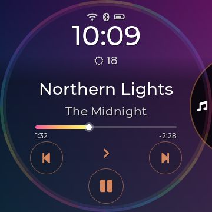 Closed: the shard on the right rim</td>
<td align="center" valign="top" width="33%">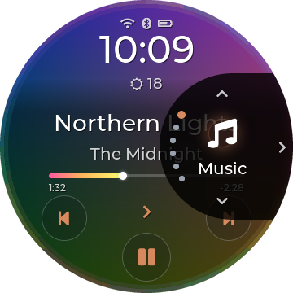 Open: icon, name and section dots</td>
<td align="center" valign="top" width="33%">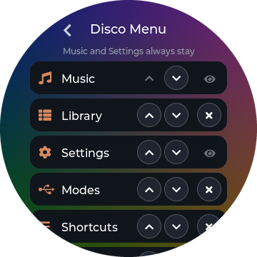 Disco Menu: reorder, add, remove</td>
</tr>
</table>

### Gestures

| Gesture | What it does |
|---|---|
| Swipe right from the **left edge** | Back. A bubble with an arrow follows your finger and fills with the accent colour once the swipe will count. |
| Swipe up from the **bottom edge** | Go to Music. A bubble with a home icon rises with your finger, the same way. |
| Pull down from the **top edge** | Open Quick Settings. Swipe up to close it. |
| Swipe left on **Music** | Open Shortcuts (not when the swipe starts on the progress line or arc: that seeks). |
| Drag along the **rim** of a long list | Scroll fast; a big letter shows where you are. |
| **Hold** a back control | Go straight to Music instead of one step back. |

The distance a back swipe needs can be changed under Display > Back-swipe.

<table>
<tr>
<td align="center" valign="top" width="33%">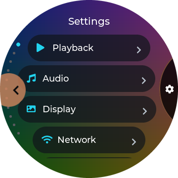 Back swipe, armed</td>
<td align="center" valign="top" width="33%">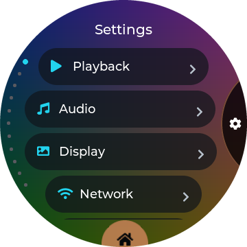 Swipe up for Music, armed</td>
</tr>
</table>

### Quick Settings

Pull down from the top edge. The playing album sits in the round field on the right, with its progress ring and
a play/pause button; tap the cover to go to Music. Drag the **arc at the top** for brightness; the **arc at the
bottom** shows the battery.

Five rows of pills on the left; Wi-Fi and Bluetooth share the top one, each an icon with a round **On/Off** badge
(filled with the accent when on; it shows the radio as it really is):

| Row | Tap | Hold |
|---|---|---|
| Wi-Fi | Switch Wi-Fi on or off. | Open Wi-Fi settings. |
| Bluetooth | Switch Bluetooth on or off. | Open Bluetooth settings. |
| Mode | Open Working mode (the icon shows the current one). | |
| Library | Open the Library. | |
| Rescan | Rescan the music card (the row reads "Scanning" while it runs). | |
| Settings | Open Settings. | |

<table>
<tr>
<td align="center" valign="top" width="33%">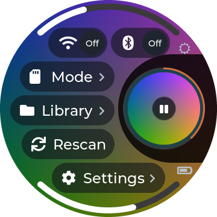 Dark</td>
<td align="center" valign="top" width="33%">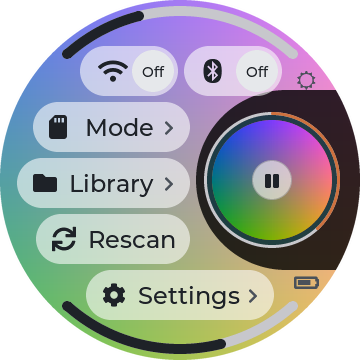 Light</td>
</tr>
</table>

### Volume

Press a volume key and the volume pops up over whatever is on screen: the round field on the right shows the
level as a big number, and an arc along the right rim fills from the bottom up. Drag the arc to set the level,
or tap anywhere else to close it; it also closes by itself after a moment. The arc fills in the CD rainbow, or
in your accent colour (Disco Options > Volume). Audio > Max Volume caps the level.

<table>
<tr>
<td align="center" valign="top" width="33%">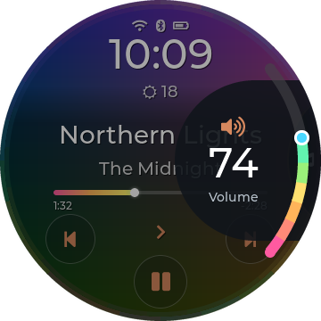 The volume field and rim arc</td>
</tr>
</table>

### Standby

After the Screensaver delay (Display > Screensaver) the screen dims to Disco's standby: the album cover,
darkened, with the weather, a large clock, the song and the artist, and the song's progress as a thin line
around the rim. It redraws only once a minute. A later Screen Off delay can switch the panel off completely.
Touch to wake.

<table>
<tr>
<td align="center" valign="top" width="33%">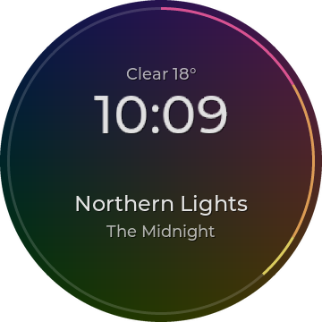 Standby</td>
</tr>
</table>

## Listening

### Music

Music is Disco's home: the playing album's cover fills the screen, sharp, with everything laid over it.

- **Top:** Wi-Fi, Bluetooth and battery icons, the time, and the weather. Tap the clock or weather to open
  [Weather](#weather). Hide this block with Disco Options > Show Clock.
- **Middle:** the title and artist, large, centred or from the left (Disco Options > Title Position). A long
  name scrolls five times, then settles with "…". **Tap the title** to open [the title menu](#the-title-menu);
  **hold it** to open the cover full screen or to favourite the song (Disco Options > Title Hold).
- **The progress** fills in the CD rainbow (or the accent, or not at all: Disco Options > Progress Bar). It is
  either a **line** under the title or an **arc** around the rim (Disco Options > Progress Shape): the arc
  starts just below the open navigation circle, runs clockwise past the bottom and the left, over the top, and
  ends just above it. **Drag or tap either one to seek.** Small elapsed and remaining times sit under the line's
  ends, or side by side in the middle with the arc (Disco Options > Track Times).
- **Below:** previous and next on the sides, play/pause at the bottom, and the **play mode** in the middle:
  tap it to cycle Sequential, Shuffle, Repeat One, Repeat All and Single (a toast names the new mode).

The text is always readable: it is dark on the light theme and white on the dark one, and the soft fade behind
it gets just as strong as each cover needs. The accent colour comes from the cover (or your own choice under
Display > Accent Colour); a too-dark or too-pale accent is adjusted so it stays visible.

<table>
<tr>
<td align="center" valign="top" width="33%"> Dark</td>
<td align="center" valign="top" width="33%">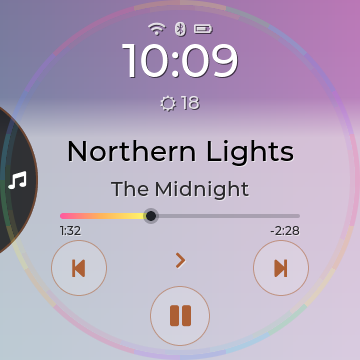 Light</td>
<td align="center" valign="top" width="33%">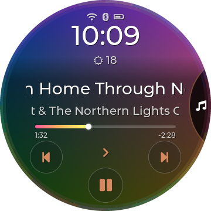 A long title scrolling</td>
</tr>
<tr>
<td align="center" valign="top" width="33%">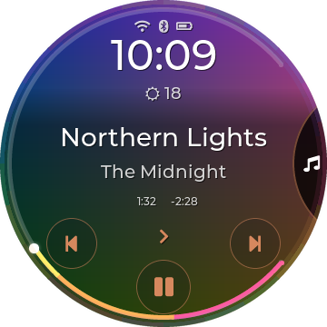 Progress Shape: Arc</td>
<td align="center" valign="top" width="33%">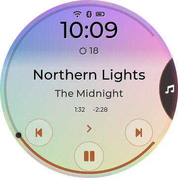 Arc in the accent colour</td>
<td align="center" valign="top" width="33%">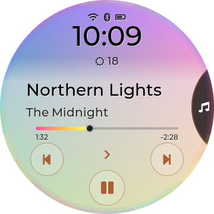 Title Position: Left</td>
</tr>
</table>

### The title menu

Tap the title on Music. The cover dims and six buttons appear under the song's name:

| Button | What it does |
|---|---|
| Favourite | Add or remove the song from Favourites (the menu stays open). |
| Album | Open the song's album in the Library, with the song highlighted. |
| Artist | Open the artist's albums, with this album highlighted. |
| Queue | Open your [Queue](#queue-and-up-next). |
| Lyrics | Show the lyrics (from an .lrc file, the song's tags, or online if allowed). |
| Immersive | Full-screen cover art. Tap to leave. |

Tap the song's name at the top to close the menu. **Holding** the title on Music (instead of tapping it) goes
straight to Immersive or toggles Favourite, whichever you chose under Disco Options > Title Hold.

<table>
<tr>
<td align="center" valign="top" width="33%">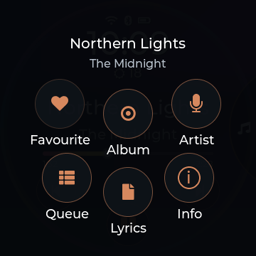 The title menu</td>
<td align="center" valign="top" width="33%">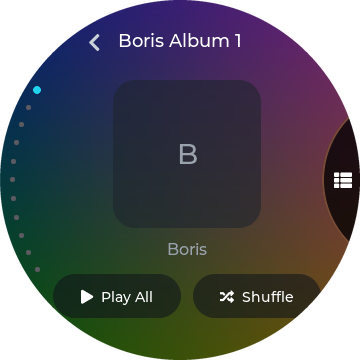 Album: straight to the album</td>
</tr>
</table>

### Queue and Up Next

**Queue** is your own list of songs to play next. Add songs with **Add to queue** in any [hold menu](#hold-menus).
Queued songs play right after the current song, in the order you added them, with Shuffle and Repeat paused
while they play; then playback returns to whatever you were listening to before. On the Queue screen:

- tap a song to play it now (the ones before it are skipped);
- drag a song by its handle (≡) to move it;
- Play starts the queue, the shuffle button shuffles it, and Clear empties it (tap twice to confirm).

The queue is saved and survives a restart.

**Up Next** shows the player's own order from the current song on, up to 100 songs. Tap a song to jump to it.

<table>
<tr>
<td align="center" valign="top" width="33%">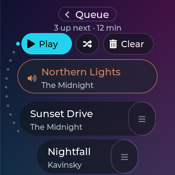 Queue</td>
</tr>
</table>

### Equalizer

Open EQ from the navigation circle or a shortcut. The first screen picks the preset: Off, the player's built-in
presets (Jazz, Rock, R&B, Hip-Hop, Pop, Dance, Classical, Retro, Sibilance 1 and 2) and ten presets of your own
(USER1–USER10, which you can rename). **Edit** opens the band editor.

The editor shows ten bands as rainbow faders, each filled up or down from 0 dB in its own colour (or all in
the accent: Disco Options > Equalizer):

- **tap a band** to select it; **drag the selected band** up or down to set its gain;
- **double-tap** a band to reset it to 0 dB;
- under the faders, tap the **frequency** or the **gain** to choose what − and + change: gain moves 0.1 dB a
  tap, frequency 1/12 octave a tap; hold − or + to repeat; tap the active value again to type it;
- the preset name at the top switches presets.

Gains run from −6 to +6 dB. Built-in presets are shown greyed out and can't be edited; only your own presets
are written to the player, and only when you change something.

<table>
<tr>
<td align="center" valign="top" width="33%">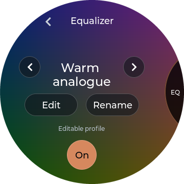 Preset choice</td>
<td align="center" valign="top" width="33%">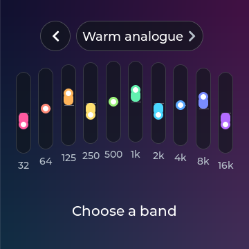 Band editor (dark)</td>
<td align="center" valign="top" width="33%">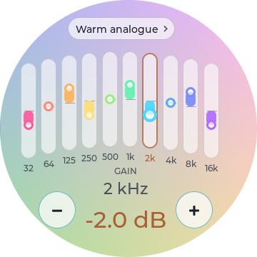 Band editor (light)</td>
</tr>
</table>

### Working mode

Choose where the music comes from and goes to: **Playback** (normal listening), **USB storage** (the computer
sees the card; eject it there before switching back), **Bluetooth DAC**, **USB DAC** and **AirPlay**. The active
mode has an accent outline and a tick; while a change is in progress, spinning arrows take the tick's place.
While a mode other than Playback is active, its own screen shows what is connected; tap **Modes** there, then
**Playback**, to go back to normal listening.

<table>
<tr>
<td align="center" valign="top" width="33%">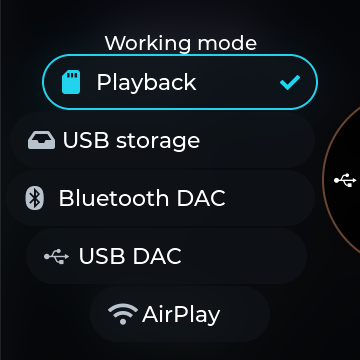 Working mode</td>
</tr>
</table>

### MA Sendspin (experimental)

A Sendspin player for [Music Assistant](https://www.music-assistant.io/): the Disc shows up in Music Assistant as a
speaker. While Music Assistant plays to it, **Music** shows the track like any song (title, artist, cover,
progress, Immersive) and its play/pause, next, previous and seeking control Music Assistant. The Disc stays awake
while it plays.

- **Turn it on** with **Sendspin** in the navigation circle (add it in Disco Options > Disco Menu) or in
  Settings > Network > MA Sendspin. It switches the Disc to AirPlay (the sound goes through the Disc's own AirPlay
  receiver) and waits for Music Assistant; picking another working mode turns it off. It comes back on after a
  restart if it was on.
- **Settings > Network > MA Sendspin:** **Server** (Auto finds Music Assistant on your network; tap to type its
  address instead), **Player Name** (how the Disc is called there), **Sync Delay** (-2000 to +2000 ms, moves the
  Disc's sound later or earlier to line it up with other speakers).
- The Sendspin screen shows the connection: Off, Looking for Music Assistant, Ready, Playing or Paused with the
  track, Can't reach Music Assistant (it keeps trying), or Wi-Fi is off (it connects once Wi-Fi is on).
- **Renamed the player** (or played with an older test version)? Music Assistant can keep the old entry as a second
  player with the same name. Play to the one that responds, and remove the stale one in Music Assistant's player
  settings.

*Experimental.* Made for Music Assistant 2.10, which still accepts the older ("legacy") Sendspin connection this
uses; a later Music Assistant that drops it will need a Disco update. The Disc's physical buttons still control the
built-in player, and streaming over Wi-Fi uses more battery than playing from the card.

<table>
<tr>
<td align="center" valign="top" width="33%">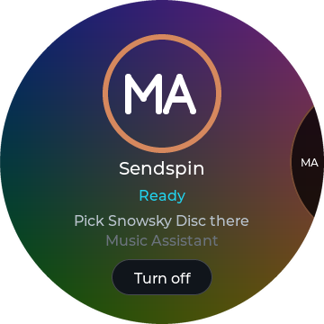 Sendspin, ready</td>
<td align="center" valign="top" width="33%">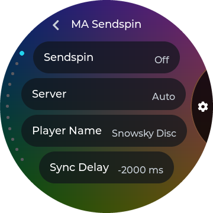 Settings > Network > MA Sendspin</td>
</tr>
</table>

## Your library

### Library

Library opens Songs, Albums, Artists, Genres, Playlists, Favourites, Folders, Books and History. Lists follow
the curve of the screen, with scroll dots on the left; an **A - Z** pill at the bottom jumps to a letter (in
Folders too, once a folder holds more than a dozen entries). Albums can be a list or a cover flow (Display > Album
View). Tap a song to play it; song lists have Play and Shuffle at the top. Artists and Genres open their albums plus
"All Songs"; going back from an artist lands on that artist in the list.

**Books** keeps .m4b audiobooks apart from music, resumes where you stopped, and has chapters. **Folders**
browses the card itself.

<table>
<tr>
<td align="center" valign="top" width="33%">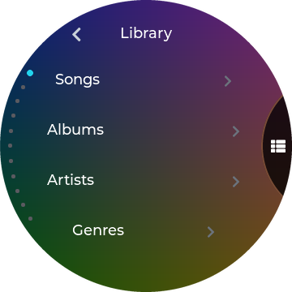 Library</td>
<td align="center" valign="top" width="33%">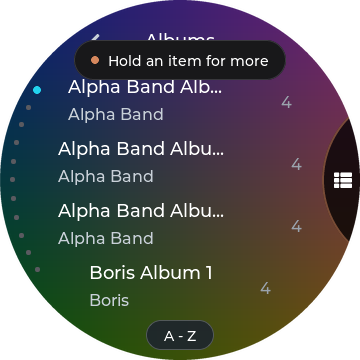 Albums, with the A-Z pill</td>
</tr>
</table>

### Hold menus

Hold a row in the Library for its actions:

| Hold a… | Menu |
|---|---|
| Song | Add to queue, Playlist, Favourite, Album, Artist, Info, Tags. |
| Album, artist or genre | Play, Shuffle, Add to queue, Playlist. |
| File (Folders) | Add to queue, Playlist, Favourite, Info, Tags, Rename, Copy / Move, Delete. |
| Folder (Folders) | Add to queue, Playlist, Tags, Rename, Copy / Move, Delete. |

A tap still plays; the menu only opens on a hold, and a song never starts playing when you let go of a hold.

### Search

Choose **Search** in the navigation circle. The landing page has a big **Search library** row and your three
most recent searches.

1. Tap **Search library** for the full-screen keyboard: big keys, 123 for digits and symbols, Backspace (tap to
   delete one letter, hold to clear).
2. Typing doesn't search yet. Press **Search** when you're ready.
3. Results list **matching artists first** (tap one to open their albums), then a line, then the songs. Tap a
   song to play it, or hold it for its menu.

Back goes from the results to the keyboard (your text kept), then to the landing page. A recent search jumps
straight to its results.

<table>
<tr>
<td align="center" valign="top" width="33%">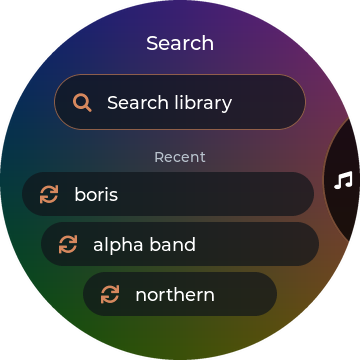 Landing page</td>
<td align="center" valign="top" width="33%">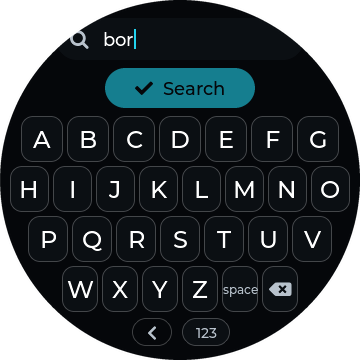 Keyboard</td>
<td align="center" valign="top" width="33%">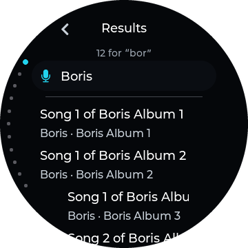 Artists first, then songs</td>
</tr>
</table>

### Shortcuts

Swipe left on Music (or pick Shortcuts in the navigation circle) for five shortcuts of your choice. Choose them
under Display > Shortcuts from: Weather, Immersive, Equalizer, Folders, Lyrics, Queue, Audiobooks, Search,
Battery, Song Info, Last.fm, All apps, and any homebrew app installed on the Disc. **All apps** lists the apps
five at a time; tap its title for the next page.

<table>
<tr>
<td align="center" valign="top" width="33%">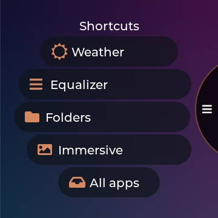 Shortcuts</td>
</tr>
</table>

## Make it yours

### Settings

Settings opens Playback, Audio, Display, Network, System and Battery. Each group is a curved list, four rows in
view; tap a row to cycle its value, open it, or run it. Settings that only matter for Disco are gathered in
[Disco Options](#disco-options), and settings that don't apply to Disco (Now Playing style, Disc Colour, Saver
Style) are hidden while Disco is on.

| Group | Highlights |
|---|---|
| Playback | Play Mode, Equalizer, Custom EQ, Resume Playback (Off / Position / Song), Artists by artist or album artist, Play Through Folders, Auto-tag (adds missing lyrics and artwork to tags over Wi-Fi). |
| Audio | Working Mode, Gain, DAC Filter, ReplayGain, DRE, Gapless, Max Volume, Balance. |
| Display | Brightness, Theme, Disco Options, Appearance (Dark/Light), Font Size, Screen Rotation, Automatic Appearance (light by day, dark at night), Outdoor Mode, Track Numbers, Online Album Art, Online Lyrics, Shortcuts, Album View, Accent Colour, Album Art Cache, Screensaver, Screen Off, 24-Hour Time, Animations, Weather on Home, Back-swipe. |
| Network | Wi-Fi, MA Sendspin, Bluetooth, Bluetooth Codec (SBC, AAC, LDAC levels). |
| System | Language, Sleep Timer, Idle Power-off, Charging Limit, Volume Keys (press, double press, hold), Rescan Library, Import Playlists, Default UI, date and time, Restart, Device Info, Update from SD Card, Reset diskOS Settings, Debug Mode, About, Shut down player. |
| Battery | The [battery](#battery) page. |

Font Size changes the text of lists, titles and search results.

Typing (a Wi-Fi password, the Sendspin server or name, a playlist name) uses a big keyboard like Search's: **Aa**
for a capital, **123** and **#+=** for digits and symbols, Backspace (hold to clear), then the tick to save.

<table>
<tr>
<td align="center" valign="top" width="33%">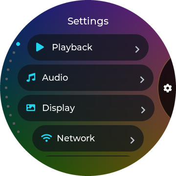 Settings</td>
<td align="center" valign="top" width="33%">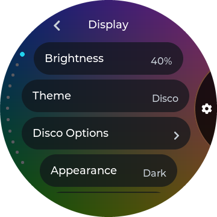 Display, with Disco Options under Theme</td>
<td align="center" valign="top" width="33%">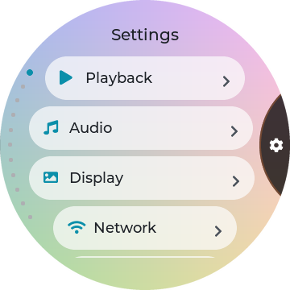 Light</td>
</tr>
</table>

### Disco Options

Display > Disco Options (only shown with the Disco theme):

| Row | Choices |
|---|---|
| Disco Menu | The sections of the navigation circle: reorder, add, remove. |
| Show Clock | The clock, status icons and weather on Music. On by default. |
| Track Times | Elapsed and remaining time with the progress. On by default. |
| Rim Sheen | The faint CD rainbow around the edge of Music and playlists. On by default. |
| Equalizer | Fader colours: Disco (a rainbow) or Accent. |
| Volume | Volume arc colour: Disco or Accent. |
| Progress Bar | The progress on Music: Disco (rainbow), Accent or Off. |
| Progress Shape | Linear (a line under the title) or Arc (around the rim, from just below the menu, clockwise, to just above it). |
| Track Number | "3. Northern Lights": the track number from the song's tags before the title on Music. Off by default. |
| Title Position | Centred or Left. |
| Title Hold | What holding the title does: Immersive, Favourite or Nothing. |
| Immersive | The full-screen cover: Vinyl (grooves and a dark label) or CD (a clear hub, a still rainbow sheen and faint spokes). |

<table>
<tr>
<td align="center" valign="top" width="33%">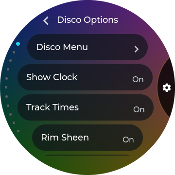 Disco Options</td>
<td align="center" valign="top" width="33%">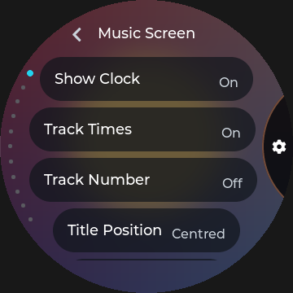 Further down: shape, title</td>
<td align="center" valign="top" width="33%">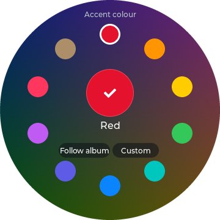 Accent colour</td>
</tr>
</table>

### Themes

Display > Theme. Every theme has a Dark and a Light appearance, and Automatic Appearance can switch between them
by the time of day.

| Theme | Look |
|---|---|
| **Disco** | The album cover as the interface; glass panels, a CD sheen, the navigation circle on the right edge. |
| **Ring** | Black (or off-white in Ring Light), the cover in a progress ring, round orbit menus, red or lime button rims. |
| **Braun** | 1970s hi-fi: a speaker-grille face, an analogue clock, knobs and faders, orange accents. |
| Stone | diskOS's rounded theme, kept from upstream. |

**Ring and Braun** work the same way as Disco with one difference: there is no navigation circle. Their
**Home** screen holds the clock and the playing song, with buttons for the Library, playback and Search, and
the sections are reached from Home and from round "orbit" menus around a central back button. The gestures,
settings, Queue, Search, hold menus, EQ functions and Quick Settings are the same.

#### Ring

The progress ring is the whole idea. On **Home** the clock sits inside the playing song's progress ring, with the
date and weather above it and the cover riding along the ring. **Now Playing** shows a round cover with the progress
ring hugging it (drag the ring to seek), the heart and the play mode at the ring's sides, and large title and
artist. Menus are round "orbits" of buttons. Ring is black with red button rims; **Ring Light** is off-white with
lime. Music surfaces follow the album colour, or your own Accent Colour.

#### Braun

A 1970s hi-fi in the spirit of Dieter Rams' Braun SK4 radio. **Home** is an analogue clock dial on a speaker-grille
face, with the weather in a small window and the song on a solid panel that follows the round edge. Switches are
knobs (off points up, on turns 45° and goes orange), the equalizer is a fader bank, the volume popup is a rim scale
with a big number, and lists stay straight with a single orange dot for the current row. **Braun** is warm white;
**Braun Dark** is charcoal with aluminium knobs.

#### Stone

diskOS's own rounded theme, kept from upstream: pill-shaped controls, a clock split into hour and minute blocks, and
on Now Playing a thick seek ring with a pill-shaped play key. It keeps upstream's Home and Now Playing screens; menus,
lists and popups follow this project's layouts in Stone's colours and fonts.

<table>
<tr>
<td align="center" valign="top" width="25%">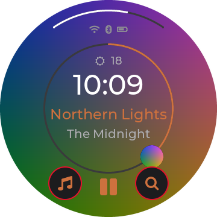 Ring</td>
<td align="center" valign="top" width="25%">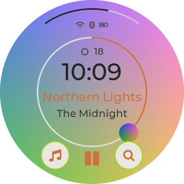 Ring Light</td>
<td align="center" valign="top" width="25%">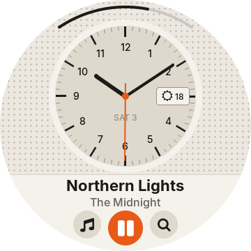 Braun</td>
<td align="center" valign="top" width="25%">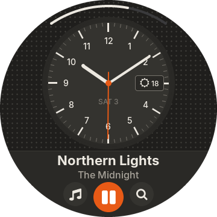 Braun Dark</td>
</tr>
<tr>
<td align="center" valign="top" width="25%">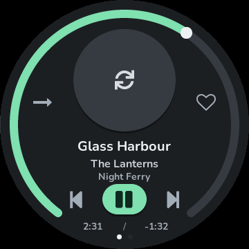 Stone (Now Playing)</td>
</tr>
</table>

## More

### Weather

Weather shows the current conditions in the round field on the right (icon, temperature, sky, place, today's
high and low) and the next 12 hours in 3-hour rows on the left. **Tap the place** to type a city; **hold it** to
go back to automatic location (by your internet connection). Weather needs Wi-Fi; Display > Weather on Home
turns it off.

<table>
<tr>
<td align="center" valign="top" width="33%">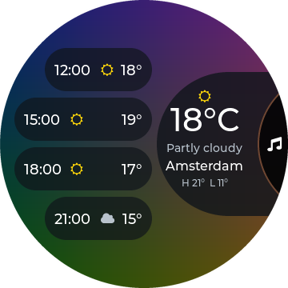 Dark</td>
<td align="center" valign="top" width="33%">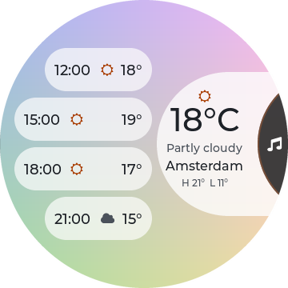 Light</td>
</tr>
</table>

### Battery

Settings > Battery (or a shortcut) shows the charge on a ring around the screen (green while charging, red at
15% or less), the percentage, the time left at your recent pace, and two figures **since the last full charge**
(and how long ago that was): time spent playing and time with the screen on. A full charge is 100%, or 80% with
Charging Limit on, counted when you unplug (or start the Disc up full after charging it switched off). Until a full
charge has been seen, the figures cover the last 24 hours. The estimate uses only your latest unbroken stretch of
discharge (a charge, a level that went up or the Disc being off starts a new one), so it settles after about
half an hour on battery. Without a set clock the figures show "-".

<table>
<tr>
<td align="center" valign="top" width="33%">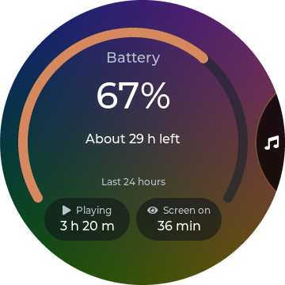 Battery</td>
</tr>
</table>

### Updates and safety

- **Updates from the SD card or a flash.** There are no online updates. Settings > System > Update from SD Card installs a signed update from the
  card's `diskos-update` folder. Every update is checked twice (when it is copied in and again at start-up),
  then runs as a **trial**: it becomes permanent only after music has actually played or you tap **Keep** on
  the one-time question. A trial that never proves itself, or keeps crashing, is rolled back to the previous
  version automatically. See [How-to](HOWTO.md#update-from-the-sd-card).
- **The stock interface is always there.** If the Disco! interface ever stops, the Disc falls back to FiiO's
  own interface until the next restart; your music and settings are untouched. Settings > System > Default UI
  can make stock the normal choice, and holding Volume Up from power-on boots the other interface once.
- **Settings > System > About** shows the version (e.g. "Disco! 1.2.0") with the exact build ID, and the diskOS
  version underneath.
- **The rescan dot.** While the library is being rescanned, a small dot runs around the rim of the screen.

<table>
<tr>
<td align="center" valign="top" width="33%">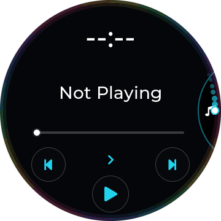 The rescan dot on the right rim</td>
<td align="center" valign="top" width="33%">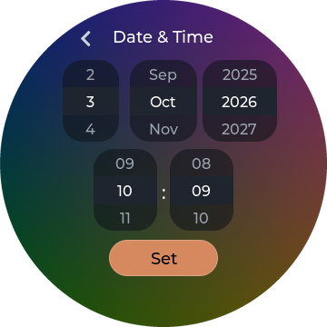 Date &amp; Time</td>
</tr>
</table>

### Limits

- Made for firmware V2.57. Older firmware can lack some player controls (they say "Not on this firmware").
- With both Wi-Fi and Bluetooth on at shutdown, the stock player keeps Bluetooth and turns Wi-Fi off at the
  next start; Disco! follows that so the two radios don't fight.
- Search shows up to 80 songs (and up to 4 artists); type more to narrow it down.
- Bluetooth output, Last.fm and AirPlay are still experimental.
- This is a hobby project, provided as-is, for testing. Not affiliated with FiiO or Snowsky.

## Album Roulette

**A little record-shop serendipity, using the music you already own.** Album Roulette picks an album from your
local library and turns the choice into a roulette spin. Circular covers race across the screen like discs in a
CD changer, slow down, and settle on one winner. You decide whether to play it.

It is especially fun when your collection is bigger than your memory: the album you forgot you loved gets the
same chance to catch your attention as the record you played yesterday. There is no search to phrase or artist
to remember. Press a button, watch the covers fly, and see where you land.

### How a spin works

1. Open **Album Roulette** from the Disco main menu, Apps or an app shortcut. The firmware shows the vinyl
   landing page. Tap **I feel lucky!** to launch the installed app.
2. The app prepares its album selection from your local library. Its roulette-themed start screen has
   **Surprise me** and **Exit**, with a small ball around the wheel while preparation is underway.
3. Tap **Surprise me**. Round album covers fly from right to left, fast at first, then progressively slower
   until the winning cover comes to rest. The album title and artist tell you what chance has picked.
4. Tap the white **Play!** ball **or the winning cover**. The cover zooms and fades into the Music screen,
   and the selected album starts in sequential order. You get the album experience, in track order.
5. Fancy another go? **Long-press the winning cover** to return to the start screen for a fresh spin. It is
   an intentionally unlabelled shortcut. **Exit** leaves the app without choosing an album to play.

The current app only considers albums with **more than three tracks**. That keeps one-, two- and three-track
entries out of the draw and helps avoid some incomplete imports, though it cannot prove that an album is complete.
It works with your indexed local collection; it does not fetch new music for you.

### Why it belongs on the Disc

The spinning discs suit the round screen, but the useful part is the decision it takes off your hands.
Album Roulette gives you a starting point when you have plenty of music and no idea what to put on. Because
playback waits for your tap, you can enjoy the reveal without immediately replacing what is playing. Once you
accept the winner, the album plays sequentially: a chance to hear the quieter tracks between the favourites,
not just revisit the songs you already reach for.

### Add it to your menu

From Disco! 1.2.2, Album Roulette ships as a separate user app in the release package.
Install or update it under `/usr/data/apps/album-roulette/app` using the
[app installation instructions](ALBUM_ROULETTE_INSTALL.md). UI-only updates do not
install the app. Existing configuration is preserved by the documented install commands.

In **Settings > Display > Disco Menu**, add **Album Roulette**. Its vinyl entry
can be reordered or removed like other optional entries. Apps and app shortcuts
reach the same landing page. **I feel lucky!** launches the installed app, or
shows an installation reminder when it is absent.

The firmware landing page follows the selected theme and accent. Its vinyl is
static, with no animation timer or idle redraw loop. The separate app supplies
the roulette spin and album selection.

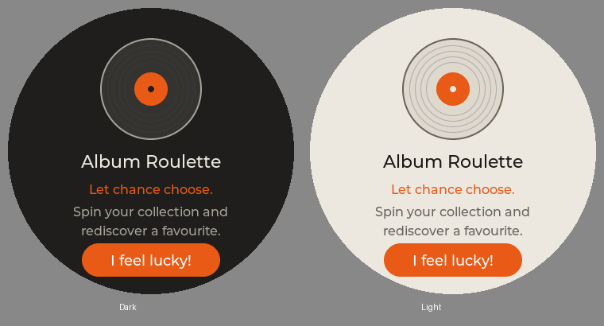

### Scrolling in 1.2.0

Scrollable screens use a lighter drag threshold. Library and the shared curved lists resize rows continuously
instead of stepping between width bands. Settings categories and submenus use that same shared treatment.
Long virtual lists keep their existing small window of live rows, A-Z navigation and rim scrolling. Straight-row
themes retain their layout. Quick Settings moves the Wi-Fi/Bluetooth pills 4 px upward; Working mode has larger
rows and text while keeping all five choices on screen.
