# A tour of diskOS 1.2.0

diskOS is a touch interface for the FiiO Snowsky Disc's 360x360 screen. It uses the player supplied by the installed stock firmware. The available player controls can differ on V2.09, V2.28, V2.40, and V2.57; a setting that cannot be applied says "Not on this firmware".

[Home](../README.md) | [Install](INSTALL.md) | [Docs](README.md)

## On this page

- **Getting around:** [Home](#home), [Quick Settings](#quick-settings), [Volume](#volume), [Screensaver and screen off](#screensaver-and-screen-off).
- **Listening:** [Now Playing](#now-playing), [Now Playing menus](#now-playing-menus), [Up Next](#up-next), [Song Info and lyrics](#song-info-and-lyrics), [Equalizer](#equalizer).
- **Your library:** [Library](#library), [Search and keyboard](#search-and-keyboard), [Favourites and History](#favourites-and-history), [Playlists](#playlists), [Books and chapters](#books-and-chapters), [Browse Files](#browse-files).
- **Make it yours:** [Settings](#settings), [Settings: Playback](#settings-playback), [Settings: Audio and working mode](#settings-audio-and-working-mode), [Settings: Display](#settings-display), [Eight themes](#eight-themes).
- **Connections and apps:** [Settings: Network](#settings-network), [Wi-Fi and Bluetooth](#wi-fi-and-bluetooth), [Apps, Last.fm, and weather](#apps-lastfm-and-weather).
- **System and safety:** [Settings: System](#settings-system), [Updates, startup, and power](#updates-startup-and-power), [Limits](#limits), [Safety and stock UI](#safety-and-stock-ui).

## Getting around

### Home

Home shows the time, date, battery, current song, and a weather glance when weather is enabled. Tap Library to browse music, Search to find a song, the play button to pause or resume, or the current song to open Now Playing. Tap a populated weather glance to open the forecast. Swipe left to Apps, swipe down from the top edge for Quick Settings, or use the left-edge right swipe to go back from other screens.

<table>
<tr>
<td align="center" valign="top" width="33%">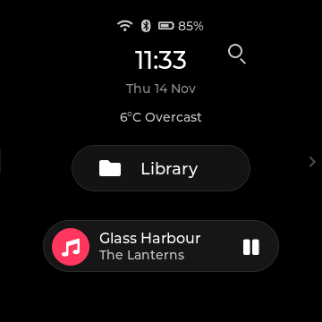 Home with a playing song</td>
</tr>
</table>

### Quick Settings

Pull down from the top edge to open the drawer and swipe up to close it. Drag Brightness at the top; an optional row adds previous, play or pause, and next. Choose up to six tiles under Display > Quick Settings, or five when playback controls are shown. A tap acts immediately; holding Wi-Fi, Bluetooth, EQ, Shuffle, Gapless, High Gain, DRE, Outdoor, or Theme opens its full setting.

| Tile | Tap action |
|---|---|
| Wi-Fi; Bluetooth | Toggle the radio. |
| EQ | Switch between Off and the last preset, starting with Rock. |
| Search; Rescan; Source; Screen off | Open Search, start or stop a library scan, open Working Mode, or turn the screen off. |
| Shuffle; Favourite; Lyrics; Timer | Toggle Shuffle, toggle the current song's favourite state, open Lyrics, or open Sleep Timer. |
| Gapless; High Gain; DRE | Toggle the named audio setting; High Gain reports unsupported firmware when its command is unavailable. |
| ReplayGain; Outdoor; Theme | Open ReplayGain, toggle Outdoor Mode, or cycle to the next theme. |

Wi-Fi, Bluetooth, EQ, Search, Rescan, and Source are the initial tiles. The other tiles and playback controls start hidden until selected in the tile picker. Tiles that depend on a song or supported firmware can report why an action was refused.

<table>
<tr>
<td align="center" valign="top" width="33%">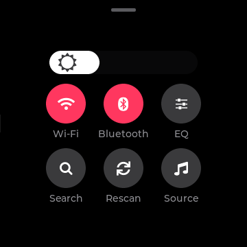 Initial drawer</td>
<td align="center" valign="top" width="33%">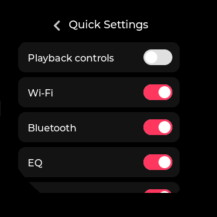 Available tile switches</td>
</tr>
</table>

### Volume

Press a volume key to change the level when that key action is set to Adjust Volume; the on-screen volume display appears with the new value. Drag its arc to set a level, or tap away to close it. Audio > Max Volume caps the value sent to the player. Volume key press, double press, and long press actions can be changed on V2.57.

<table>
<tr>
<td align="center" valign="top" width="33%">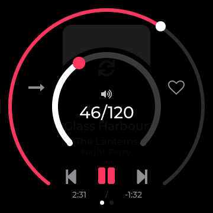 Volume arc and number</td>
</tr>
</table>

### Screensaver and screen off

After the Screensaver delay, the screen dims to a clock view; a later Screen Off delay can turn the panel fully off. Choose Cover, Analog, Minimal, Digital, or Vinyl under Saver Style, and set either delay to Off if you do not want that stage. Touch wakes the screen. The saver shows the current song and optional weather where the selected style has room for them.

<table>
<tr>
<td align="center" valign="top" width="33%">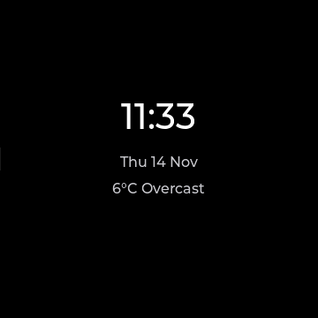 Default saver style</td>
</tr>
</table>

## Listening

### Now Playing

Now Playing shows the current song, elapsed and remaining time, playback controls, play mode, and a Favourites heart; most themes also show cover art and album. Tap previous, play or pause, and next for transport; tap the heart to add or remove the current music track from Favourites, and tap the mode icon to cycle Sequential, Shuffle, Repeat One, Repeat All, and Single. Drag the progress control to seek, tap visible cover art for full-screen art, and tap the moon to choose a sleep timer; a book also offers End of chapter. Swipe left across the page to the Options hub, or open its context and tuning panels with the on-screen side controls; a deliberate right swipe returns, while a short drag on the seek control stays a seek.

The Display > Now Playing choice sets Cover or a spinning Vinyl image. Default and something place art inside a round seek ring; hi-fi adds an LCD-like time readout, blueprint adds cover crop marks, and stone uses a thick ring and pill-shaped play key. Bauhaus splits the art and controls with a straight seek bar, zine tapes art above a highlighter-style bar, and terminal hides art for a text readout and straight bar. Vinyl freezes when paused and spins while the screen is showing a playing track; a missing cover uses a placeholder where art is shown.

<table>
<tr>
<td align="center" valign="top" width="33%">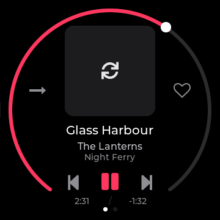 Default cover layout</td>
<td align="center" valign="top" width="33%">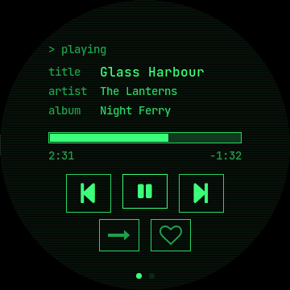 Terminal's straight seek bar</td>
</tr>
<tr>
<td align="center" valign="top" width="33%">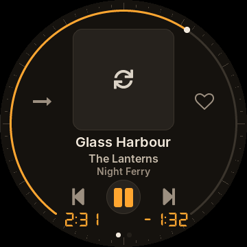 Hi-fi faceplate layout</td>
<td align="center" valign="top" width="33%">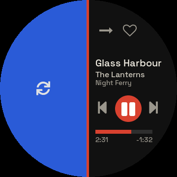 Bauhaus split layout</td>
<td align="center" valign="top" width="33%">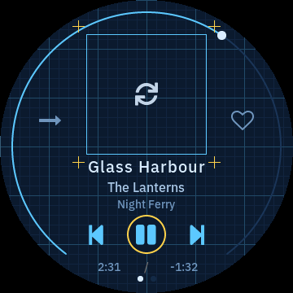 Blueprint cover layout</td>
</tr>
<tr>
<td align="center" valign="top" width="33%"> Stone's rounded controls</td>
<td align="center" valign="top" width="33%">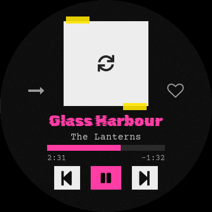 Zine's paper layout</td>
</tr>
</table>

### Now Playing menus

The Options hub opens Up Next, full-screen art, Equalizer, Song Info, Lyrics, the current Album or Artist, and Add to Playlist for a music track. For an audiobook it instead offers Chapters, Book details, Equalizer, and full-screen art. The separate context panel provides Favourites, Add to Playlist, Song Info, and Album or Artist shortcuts. The tuning panel has left and right controls for Play Mode and Equalizer, plus a Custom EQ shortcut; tap a row or arrow to make the shown choice and use Back to return.

<table>
<tr>
<td align="center" valign="top" width="33%">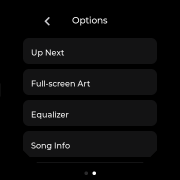 Music options hub</td>
<td align="center" valign="top" width="33%">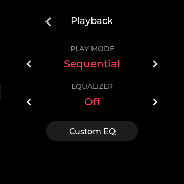 Play mode and EQ controls</td>
</tr>
</table>

### Up Next

Open Up Next from the music Options hub to see the current song and the player's upcoming order. Tap the current row to return to Now Playing, or tap an upcoming row to jump there. The list refreshes when the track or play mode changes and reports when the player's queue is being rebuilt. It shows at most 100 upcoming rows, with the rest summarized; it has no add, remove, or reorder action.

<table>
<tr>
<td align="center" valign="top" width="33%"> Current and upcoming songs</td>
</tr>
</table>

### Song Info and lyrics

Song Info displays the current file's available title, artist, album, genre, format, sample rate, bit depth, bitrate, channels, duration, size, folder, and filename. Unknown technical fields are hidden instead of guessed; for a book the labels change to Author, Progress, and Total length, with Narrator when available. Scroll the page to see lower fields and use Back to return.

Lyrics first looks for a local .lrc beside the song, then lyrics embedded in its tags; with Online Lyrics enabled it can look up missing words over Wi-Fi. Timed .lrc lines follow the track position and can be scrolled by hand; plain lyrics can be read as a scrolling page. The online switch affects diskOS's lookup only, so local or embedded words still work when it is Off. Tap Back to return to the song.

<table>
<tr>
<td align="center" valign="top" width="33%"> Available track details</td>
<td align="center" valign="top" width="33%">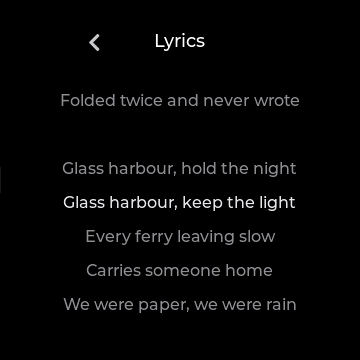 Timed local lines</td>
</tr>
</table>

### Equalizer

The Equalizer row offers Off, Jazz, Rock, R&B, Hip-Hop, Pop, Dance, Classical, Retro, Sibilance 1 and 2, and USER1 through USER10. Custom EQ shows ten fixed bands from 32 Hz to 16 kHz plus a master level; choose a USER slot, scroll sideways to reach more bands, and drag its sliders within -12 to +12 dB. On firmware where the stock curve can be written, changes save to that slot and are sent to the player; the audible result of presets still needs device confirmation. On V2.57 the Custom EQ editor is view-only, so do not expect slider changes to apply there.

<table>
<tr>
<td align="center" valign="top" width="33%">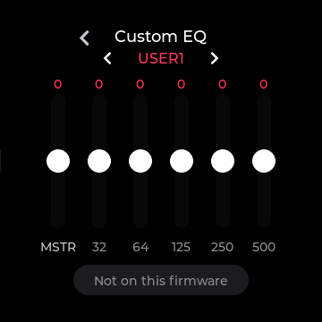 Ten-band editor</td>
</tr>
</table>

## Your library

### Library

Library opens Songs, Albums, Artists, Genres, Playlists, Favourites, Folders, Books, and History. History contains Most Played and Recently Played. Tap a category and then an item to open its next level; tap a song to play it, or use Play and Shuffle at the top of a song list. Hold an album, artist, or genre row to play its songs, and use the Add to Playlist row inside an album, artist, or genre song list to add that displayed group. Drag along the outer edge to scroll a long list, or tap the A-Z control and a letter to jump; the left-edge right swipe remains Back.

Songs is the complete indexed music list. Artists and Genres open a list of their albums plus All Songs, while Albums opens an album's cover and tracks. Album View can switch the Albums list to Cover Flow: flick or drag the covers, use the rim to move through them, tap the centered album to open its tracks, or hold it to play the album. A cover wall can show placeholders until artwork has been cached; playing a track with art can fill that cache.

<table>
<tr>
<td align="center" valign="top" width="33%">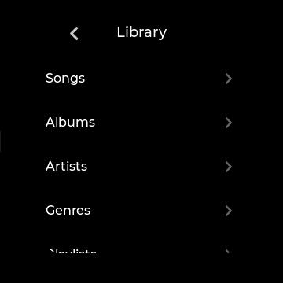 Library categories</td>
<td align="center" valign="top" width="33%">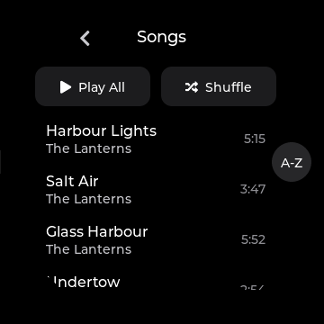 Indexed song list</td>
<td align="center" valign="top" width="33%">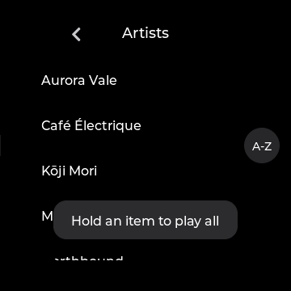 Artist groups</td>
</tr>
<tr>
<td align="center" valign="top" width="33%">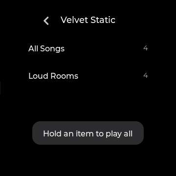 All Songs and album drill</td>
<td align="center" valign="top" width="33%">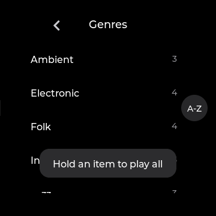 Genre groups</td>
<td align="center" valign="top" width="33%">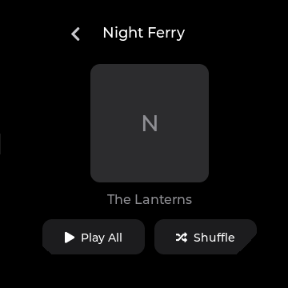 Cover and track list</td>
</tr>
<tr>
<td align="center" valign="top" width="33%">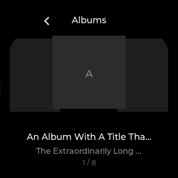 Album cover browsing</td>
<td align="center" valign="top" width="33%">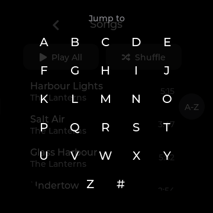 A-Z jump control</td>
</tr>
</table>

### Search and keyboard

Tap Search on Home or in Quick Settings, then tap the search field to open the on-screen keyboard. Search matches indexed song, artist, and album information and shows song results; tap a result to play it, or tap X to clear the query. The keyboard has case, number and symbol, space, backspace, OK, and cancel controls; hold backspace to clear the field. Search shows at most 80 results and asks you to narrow a longer match list.

<table>
<tr>
<td align="center" valign="top" width="33%">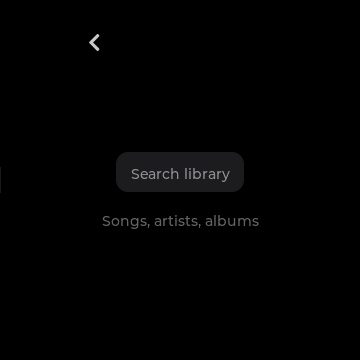 Empty search field</td>
<td align="center" valign="top" width="33%">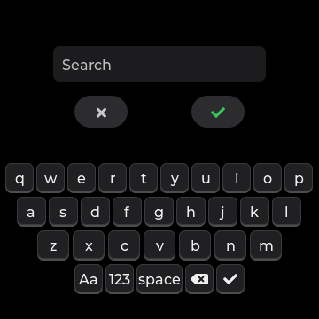 Text entry keys</td>
</tr>
</table>

### Favourites and History

Tap the heart on Now Playing, use the current-song context action, or enable the Quick Settings Favourite tile to change the current song's state. Library > Favourites lists loved tracks; tap one to play it and hold one to remove it. Play and Shuffle act on the Favourites list. History's Most Played and Recently Played lists let you tap a song to play it; their order follows listening history rather than the alphabet.

<table>
<tr>
<td align="center" valign="top" width="33%">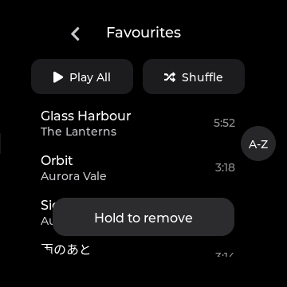 Loved tracks</td>
</tr>
</table>

### Playlists

Library > Playlists lists saved playlists with song counts. Tap New Playlist and type a name, or use Add to Playlist from a playing song or a displayed album, artist, or genre group; choose a playlist in the picker. Tap a playlist to see its ordered songs, Play and Shuffle buttons, and its menu. Tap a song to play it, hold a song to remove that entry, or use the menu to Edit Name, Export to SD as M3U, or Delete Playlist after confirmation; deleting a playlist leaves music files alone. Settings > System > Import Playlists searches the card for .m3u and .m3u8 files and imports recognized library tracks, keeping a separately named copy when a same-name list differs.

<table>
<tr>
<td align="center" valign="top" width="33%">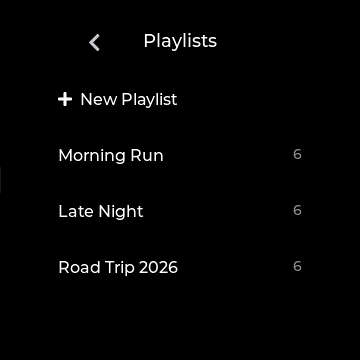 Playlist list and New Playlist</td>
<td align="center" valign="top" width="33%">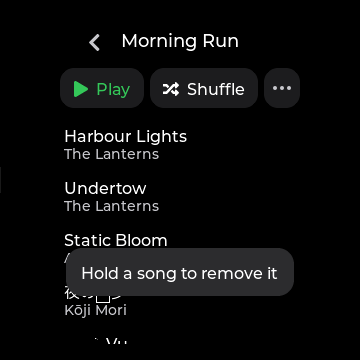 Ordered playlist songs</td>
<td align="center" valign="top" width="33%">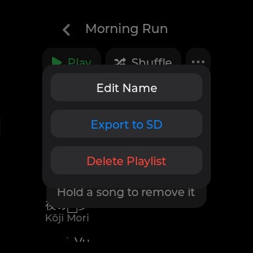 Rename, export, and delete</td>
</tr>
<tr>
<td align="center" valign="top" width="33%">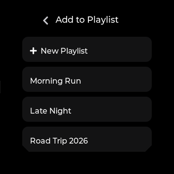 Choose a destination list</td>
</tr>
</table>

### Books and chapters

Library > Books lists indexed .m4b audiobooks separately from music, with author and saved progress. Tap a book to resume; after time away, diskOS rewinds the saved position slightly, and a finished book starts from the beginning. From a playing book, open Options > Chapters and tap a chapter to seek to its start; Book details opens the information page. The Now Playing moon offers End of chapter for books, and books stay in Single play mode.

### Browse Files

Library > Folders opens the microSD card as folders and files. Tap a folder to descend, the header Back control to ascend, or a supported file to request playback. A .cue sheet and an indexed SACD .iso can open their track rows through the library. A file must already be in the library database: an unindexed selection reports "Not in library", and ordinary file playback uses the all-songs queue rather than a folder-only queue.

## Make it yours

### Settings

Settings groups the controls into Playback, Audio, Display, Network, and System. Tap a group, scroll its rows, and tap a row to cycle a choice, open its detail, or run the named action; sliders can be dragged. Read-only rows show information without changing it. Values in the tables below are the first-run diskOS defaults; existing stock player values can still matter until you choose an Audio setting that says System default.

<table>
<tr>
<td align="center" valign="top" width="33%">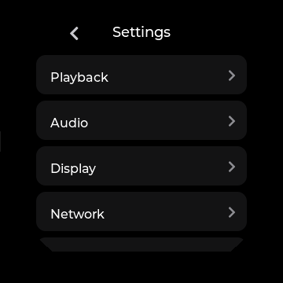 Five settings groups</td>
</tr>
</table>

### Settings: Playback

Playback controls what plays next and how the player treats a resumed track. Tap a choice to change it, or open Custom EQ for its own editor. Firmware-specific rows remain visible with an unavailable message where needed.

| Row | Action and default |
|---|---|
| Play Mode | Sequential by default; choose Shuffle, Repeat One, Repeat All, or Single. |
| Equalizer | Off by default; choose a built-in or USER preset. |
| Custom EQ | Open the ten-band USER preset editor. |
| DSD Output | Read-only Auto; diskOS does not offer a DSD output choice. |
| Resume Playback | Off by default; Position resumes the spot, Song reopens the last track. |
| Artists | By Artist by default; By Album Artist uses album-artist tags. Unsupported firmware says "Not on this firmware". |
| Play Through Folders | Off by default; asks the supported stock player to continue to the next group. Available on V2.28, V2.40, and V2.57. |

<table>
<tr>
<td align="center" valign="top" width="33%">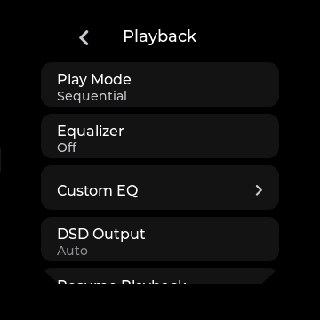 Playback rows</td>
</tr>
</table>

### Settings: Audio and working mode

Audio rows control the output path, DAC options, and volume limits. Tap Working Mode to choose Local Playback, USB DAC, Bluetooth Receiving, or USB Storage; the selected mode is marked in the list. USB Storage gives the computer the card: eject it safely there before returning to Local Playback. The SPDIF and external USB Audio controls are absent from the normal build.

| Row | Action and default |
|---|---|
| Working Mode | Open the four source modes; Local Playback is the usual music mode. |
| Gain | Low by default; choose High for a higher headphone gain. Unknown firmware says "Not on this firmware". |
| DAC Filter | Slow LL by default; choose Fast LL, Slow PC, Fast PC, NOS, or Wideband. |
| ReplayGain | Off by default; choose Track or Album leveling. |
| DRE | On by default; toggle the player's Dynamic Range Enhancement. |
| Gapless | Off by default; request playback without a gap between tracks. |
| Max Volume | 120 by default; drag the cap from 10 to 120. |
| Balance | Centered at 0 by default; drag from -10 left to +10 right. |

<table>
<tr>
<td align="center" valign="top" width="33%">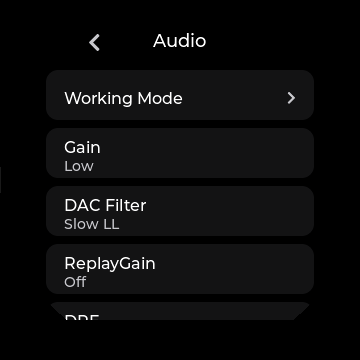 Output and DAC rows</td>
<td align="center" valign="top" width="33%">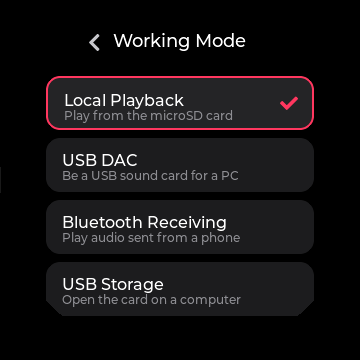 Audio source choices</td>
</tr>
</table>

### Settings: Display

Display controls the look of the interface and its idle behavior. Tap choices to cycle, switches to toggle, and sliders to drag; Theme, Accent Colour, and Quick Settings open pickers. Changing the theme or text size redraws the interface while music continues. Outdoor Mode holds a light appearance and full brightness until switched off, then restores the saved appearance and brightness.

| Row | Action and default |
|---|---|
| Brightness | 16 by default; drag from 4 to 40. Outdoor Mode holds full brightness. |
| Theme; Appearance | Default theme and Dark by default; select any of eight themes and Dark or Light. |
| Font Size | Medium by default; Small and Large affect list and body text, not clocks and titles. |
| Screen Rotation | Normal by default; 90, 180, or 270 degrees with a keep or revert prompt on V2.57. |
| Outdoor Mode | Off by default; light screens and full brightness. |
| Track Numbers | Off by default; show numbers in album song lists. |
| Online Album Art | Off by default; look up a missing album cover over Wi-Fi. |
| Online Lyrics | On by default; permit lookup of missing words over Wi-Fi. |
| Quick Settings | Open the tile picker and optional playback-control row. |
| Now Playing; Album View | Cover and List by default; choose Vinyl art or Cover Flow for Albums. |
| Accent Colour | Choose cover-derived color or a fixed color. |
| Album Art Cache | Covers only by default; optional background decoding When Idle or Idle & Charging. |
| Screensaver; Saver Style; Screen Off | 1 min, Cover, and 2 min by default; choose Off, 30 sec, 1 min, 2 min, or 5 min for each delay. |
| 24-Hour Time; Animations | Both On by default; change clock format or screen transitions. |
| Disc Colour | Black by default; choose Turquoise or Pink for the startup Disc drawing. |
| Weather on Home | On by default; Off hides the glance and skips periodic background fetches, but the current build still starts one fetch at UI startup. |
| Back-swipe | 60 pixels by default; drag from 30 to 120 pixels to change the needed travel. |

<table>
<tr>
<td align="center" valign="top" width="33%"> Display rows</td>
<td align="center" valign="top" width="33%">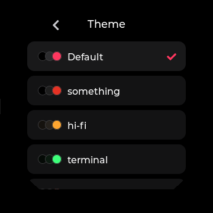 Theme choices</td>
<td align="center" valign="top" width="33%">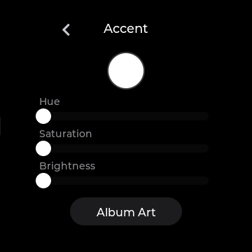 Fixed or art-derived color</td>
</tr>
</table>

### Eight themes

Display > Theme has eight built-in themes; each also has a Dark and Light appearance. Tap a theme name to apply it and use Appearance to switch its variant. The theme changes fonts, colors, and layouts, while the available music and settings actions stay the same. The Now Playing screenshots above show the most visible layout differences.

| Theme | What changes |
|---|---|
| Default | Rounded controls, a cover-centered Now Playing view, and a large Home clock. |
| something | Dot grid, dot-matrix clock and titles, fine list rules, and a red accent. |
| hi-fi | Faceplate rows, fine rules, and a segmented clock. |
| terminal | Monospace readouts, square controls, and a straight Now Playing seek bar. |
| bauhaus | Bold capitals, geometric controls, and a split Now Playing layout. |
| blueprint | Drafting lines, numbered rows, and cover crop marks. |
| stone | Rounded pill controls and a clock split into hour and minute blocks. |
| zine | Paper scraps, typewriter text, and cut-out clock digits. |

<table>
<tr>
<td align="center" valign="top" width="33%">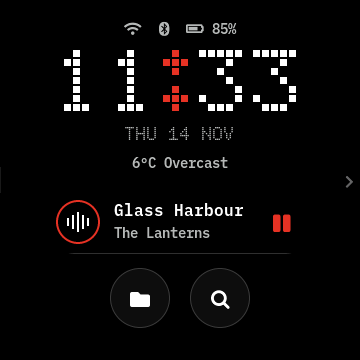 Dot-grid Home</td>
<td align="center" valign="top" width="33%">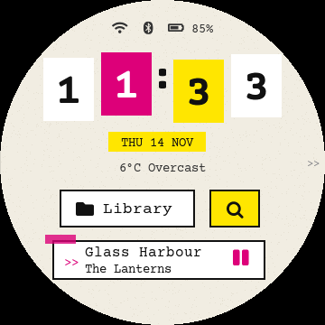 Paper Home</td>
</tr>
</table>

## Connections and apps

### Settings: Network

Network opens radio controls and Bluetooth codec selection. Tap a radio row, switch its power control, rescan, and tap a listed device or network. The codec row is available on V2.57; it says "Not on this firmware" on older bases.

| Row | Action and default |
|---|---|
| Wi-Fi | Open scanning, connection, and saved-network details. |
| Bluetooth | Open scanning, pairing, connection, and device details. |
| Bluetooth Codec | SBC by default; V2.57 offers AAC, LDAC Mobile, LDAC Standard, and LDAC High for the next headphone connection. An unsupported headphone can fall back to SBC. |

<table>
<tr>
<td align="center" valign="top" width="33%">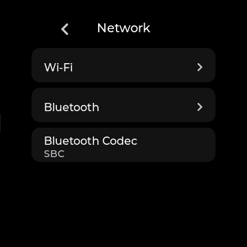 Network rows</td>
</tr>
</table>

### Wi-Fi and Bluetooth

On Wi-Fi, use the switch to enable the radio, tap Rescan to refresh the list, tap a network to connect, and enter a password when asked. Tap a connected or saved network for its information and Forget action. Bluetooth offers its own switch and Rescan; tap a found device to pair or connect, and open a connected device's details to Disconnect or Forget it. Bluetooth output is beta, and the selected codec depends on what both the firmware and headphones support.

### Apps, Last.fm, and weather

Swipe left from Home to Apps, then tap Last.fm, Settings, or an installed external app. An external app takes over the screen and touch input while it runs; its behavior depends on that app. Last.fm setup shows a QR code for entering your own API key and secret on a phone, then a second authorization step; after connection, toggle Scrobbling or tap Disconnect. It is experimental and Off until you set it up; the setup page uses plain HTTP on your local Wi-Fi.

Tap the weather glance on Home to see the forecast when a result is available. In Weather, choose a location manually or request automatic location and refresh the display. Weather depends on Wi-Fi and the remote service; an unavailable result leaves the glance empty.

<table>
<tr>
<td align="center" valign="top" width="33%">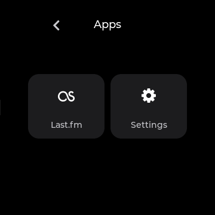 Built-in and external app tiles</td>
<td align="center" valign="top" width="33%">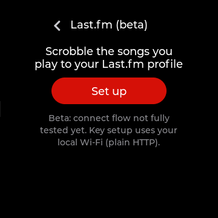 Scrobbling setup</td>
</tr>
</table>

## System and safety

### Settings: System

System covers language, power, library maintenance, time, updates, recovery, and device information. Tap an action row to open it; actions such as Restart, Reset, and updates ask for confirmation where a change will be made. Some rows are available only with V2.57 or with an update key in the installed image. Read-only rows report what the player knows rather than offering a control.

| Row | Action and default |
|---|---|
| Language | English by default; choose Simplified Chinese, Traditional Chinese, Japanese, Korean, Spanish, Portuguese, Italian, German, French, or Russian. Missing translated strings fall back to English. |
| Sleep Timer | Off by default; choose 15, 30, 45, 60, or 90 minutes. Resets on restart. |
| When Sleep Ends | Pause by default; V2.57 can instead request Shut down. |
| Idle Power-off | Off by default; V2.57 offers 5, 10, 30, 60, 90, or 120 minutes without playback or input. |
| Charging Limit | Off by default; V2.57 can request the stock charging optimization, around 80%. |
| Vol Keys: Press | Adjust Volume by default; on V2.57 a single press can instead Switch Track. |
| Vol Keys: Double Press | Adjust Volume by default; on V2.57 a double press can instead Switch Track. |
| Vol Keys: Long Press | Adjust Volume by default; on V2.57 a hold can instead Switch Track. |
| Rescan Library | Scan the card with progress shown; tap Stop to cancel pending scan changes. |
| Import Playlists | Import recognized .m3u and .m3u8 lists from the card. |
| Default UI | diskOS by default; choose Stock for future normal boots. |
| Automatic Time | On by default; network time takes effect after the next restart and Wi-Fi connection. |
| Set Date & Time; Time Zone | Set the clock by hand or choose a zone; the zone defaults to Automatic. |
| Restart | Confirm a restart; a busy card or failed flush can leave the device running with an error. |
| Device Info | Show model, firmware, diskOS build, addresses, storage, and battery details. |
| Update from SD Card | Find a stock-style update filename and explain the stock route; diskOS does not run it. |
| Allow diskOS Updates | On by default in the 1.2.0 release image; Off blocks download and staging, but a release check remains possible. |
| Update diskOS | Check for a later signed diskOS app update over Wi-Fi, then confirm download and restart. |
| Reset diskOS Settings | Confirm reset of diskOS appearance and behavior choices; music, radios, Last.fm, EQ, and audio settings remain. |
| Debug Mode | Off by default; enable temporary SSH over Wi-Fi with a new shown password. |
| Temperature; About | Read battery or board temperature and the exact diskOS build identifier. |

<table>
<tr>
<td align="center" valign="top" width="33%">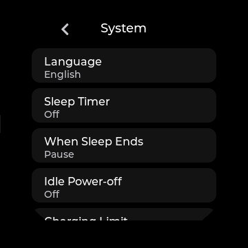 System rows</td>
<td align="center" valign="top" width="33%">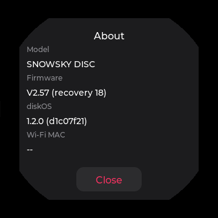 Device and build details</td>
<td align="center" valign="top" width="33%">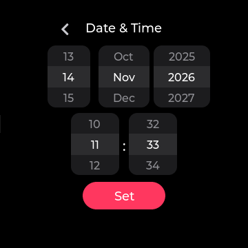 Manual clock controls</td>
</tr>
</table>

### Updates, startup, and power

Installing 1.2.0 requires a full flash; it installs the update feature, so the first update over
Wi-Fi will be a later release. The 1.2.0 release image includes the diskOS release key by default;
untick "Allow diskOS updates over Wi-Fi" when flashing to omit it. Update diskOS checks for a
newer signed diskOS app bundle. It replaces only the app, not stock firmware or the whole image.
After restarting into a trial, choose Keep or Go back; a broken update rolls back automatically.
Allow diskOS Updates can stop downloads on the Disc. Turning it off with a staged update offers
Discard or Cancel. An install without a key reports that updates are unsupported.

At startup, the Disc animation uses the body color selected under Display > Disc Colour. The stock player handles the physical power button: one press blanks the display and another restores it; the physical play/pause button controls playback through that player. The Volume Up and Volume Down keys adjust volume by default, or switch tracks according to the V2.57 Vol Keys settings. A tap wakes the idle saver, and the separate Screensaver, Screen Off, Sleep Timer, and Idle Power-off choices control later idle behavior. For USB Storage, eject the card safely on the computer before changing modes; diskOS can refuse the switch when card ownership is uncertain.

<table>
<tr>
<td align="center" valign="top" width="33%"> Disc startup animation</td>
</tr>
</table>

### Limits

The scanner indexes common music formats and also recognizes AAC, OGG, APE, AIFF/AIF, WMA, DSF,
DFF, DTS, external CUE sheets, and SACD ISO tracks; appearing in a list does not prove that every
format plays on this device. Browse Files can play only indexed files, and it does not build a
folder-only queue. V2.09 playlist and book playback may fail. V2.57's Custom EQ editor is
view-only, although Gain is available; older firmware has no Bluetooth codec choice. Up Next can
jump within the player queue but cannot edit it, and network services and Bluetooth codec behavior
remain experimental.

After a restart, Wi-Fi can take up to about a minute to connect; if it shows no IP, reconnect in
Settings > Wi-Fi. A fix is planned for 1.2.1.

### Safety and stock UI

Settings > System > Default UI > Stock makes the stock interface the normal boot choice. To use the other interface for one boot, hold Volume Up from power-on until it appears; keep holding long enough for the switch to register. Both choices leave the diskOS image installed. The installer's `restore-stock` command restores the saved stock root filesystem when you want to remove that image.
